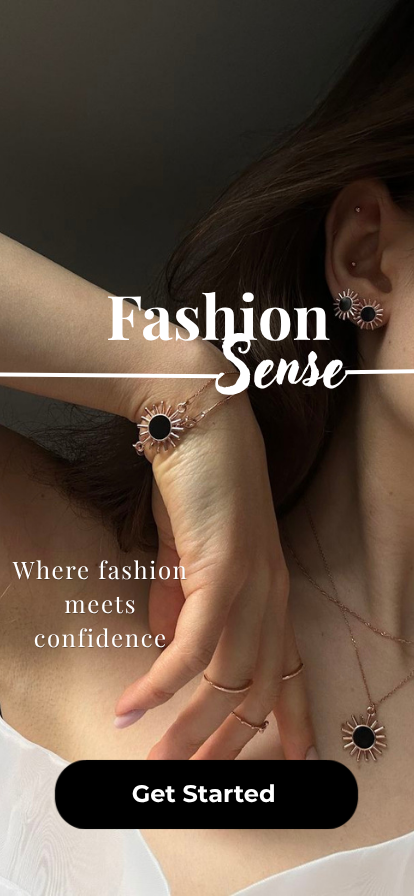
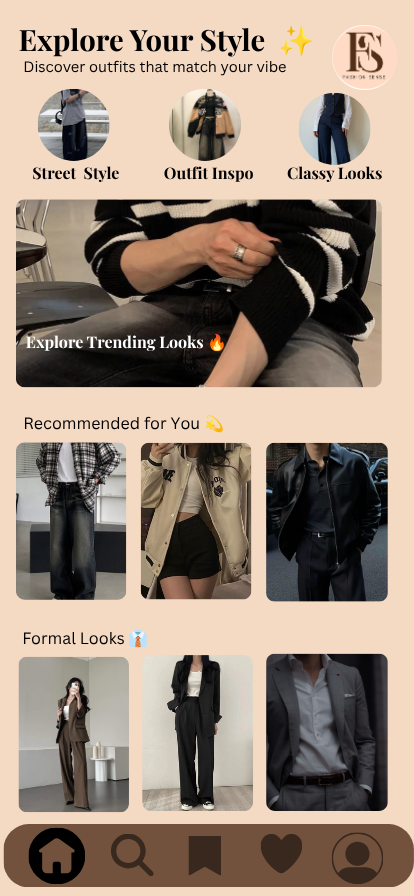
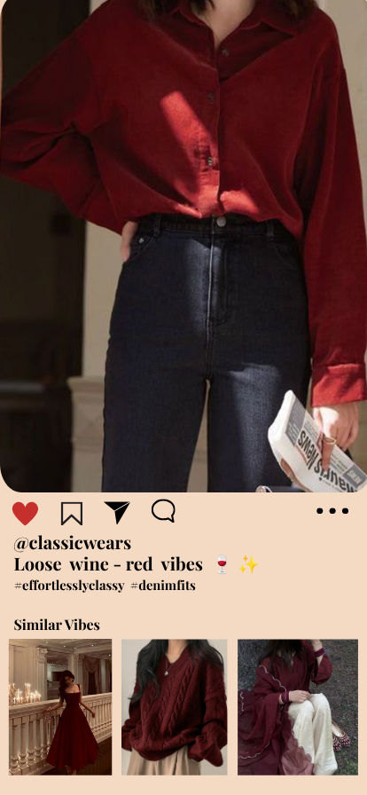
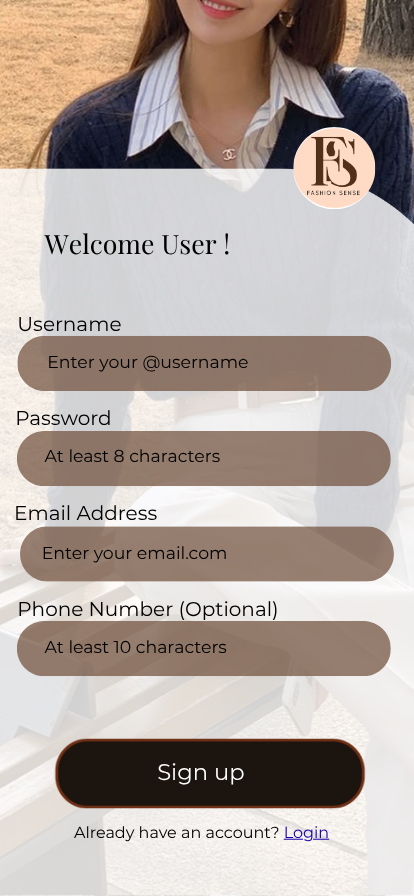
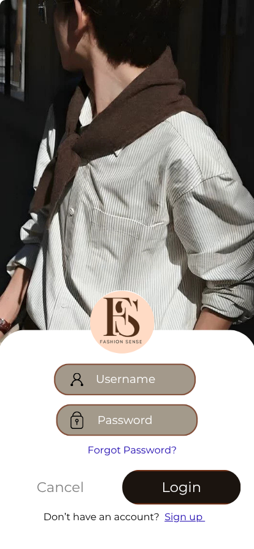

# Fashion-Sense-UI-Design-
A modern fashion mobile app UI design created using Canva. Focused on clean layout, soft neutral colors, and user-friendly experience. Includes splash, home, and authentication screens.

  

# 👗 Fashion Sense – UI Design

A modern fashion mobile app UI designed to help users explore outfit inspirations and discover their personal style.

---

## 🎯 Project Overview

Fashion Sense is a conceptual UI design project created using Canva (Free Version).  
The goal of this project was to design a clean, minimal, and visually appealing mobile interface with a focus on usability and aesthetics.

---

## ✨ Features

- Splash Screen  
- Home Screen with categorized fashion content 
- Outfit Inspiration Section  
- Login & Signup Screens
- Detail Screen 

---

## 🎨 Design Focus

- Clean and modern layout  
- Soft neutral color palette  
- Strong visual hierarchy  
- User-friendly navigation  
- Consistent spacing and alignment  

---

## 🛠 Tools Used

- Canva (Free Version)

---

## 📸 Screens

### Splash Screen

---

### Home Screen

---
### Detail Screen

---
### Signup Screen

---

### Login Screen

---

## 💡 Key Improvements

- Added active navigation states  
- Improved spacing and layout consistency  
- Enhanced input field visibility  
- Introduced subtle shadows for depth  
- Applied accent color for better interaction  

---

## ⚠️ Disclaimer

This is a self-initiated conceptual project created for learning and portfolio purposes only.  
All images used are for presentation purposes and belong to their respective owners.

---

## 🙌 Feedback

Feedback and suggestions are always welcome!
